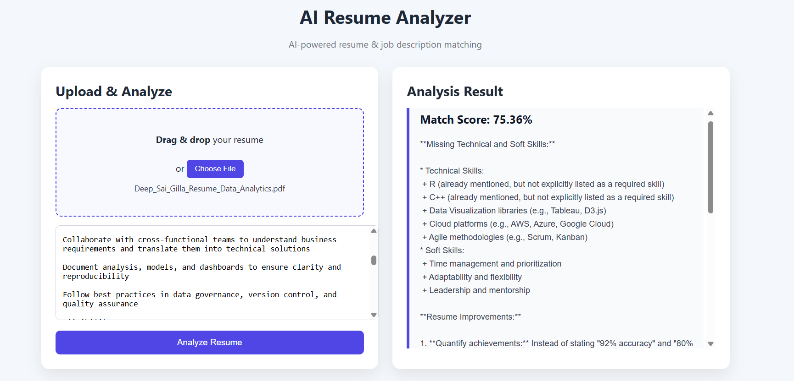

# AI Resume Analyzer & Job Matcher

An AI-powered full-stack web application that analyzes a candidate’s resume against a given job description using **NLP and Large Language Models (LLMs)**.  
The system computes a **semantic match score** and provides **intelligent suggestions** such as missing skills, resume improvements, and ATS optimization tips.

---

## 🚀 Features

- 📄 Drag & Drop PDF resume upload
- 🧠 NLP-based semantic similarity matching
- 📊 Resume–Job match percentage
- 🤖 AI-powered skill gap analysis and suggestions
- 🧾 ATS keyword recommendations
- 🎨 Clean, responsive UI with separate input/output sections
- 🔐 Secure API key handling using environment variables

---

## 🖼️ Project Output

---

## 🛠️ Tech Stack

### Frontend
- HTML
- CSS
- JavaScript (Vanilla)
- Drag & Drop File Upload

### Backend
- Python
- Flask
- Flask-CORS

### AI / NLP
- Sentence Transformers (`all-MiniLM-L6-v2`)
- Cosine Similarity (Semantic Matching)
- Groq LLM (LLaMA-based model)

---

## 🧠 How It Works

1. User uploads a **PDF resume**
2. User pastes a **job description**
3. Backend:
   - Extracts and cleans resume text
   - Generates embeddings for resume & job description
   - Calculates semantic similarity score
   - Uses Groq LLM to generate:
     - Missing skills
     - Resume improvement suggestions
     - ATS keywords
4. Results are displayed on the UI in real time

---

## 📂 Project Structure

ai-resume-analyzer/
│
├── backend/
│ ├── app.py
│ ├── utils.py
│ ├── requirements.txt
│ └── .env
│
├── frontend/
│ ├── index.html
│ ├── style.css
│ └── script.js
│
├── output.png
├── README.md
└── .gitignore

---

## ⚙️ Setup & Run Locally

### 1️⃣ Clone the Repository
git clone https://github.com/deepsaigilla/ai-resume-analyzer.git
cd ai-resume-analyzer

2️⃣ Backend Setup
cd backend
python -m venv venv
venv\Scripts\activate   # Windows
pip install -r requirements.txt

Create a .env file:
GROQ_API_KEY=your_groq_api_key_here

Run the backend:
python app.py

Backend runs at:
http://127.0.0.1:5000

3️⃣ Frontend Setup

Open:
frontend/index.html
(using browser or VS Code Live Server)

📈 Future Enhancements

Skill-wise match breakdown
Multiple resume comparison

⭐ If you like this project
Give it a ⭐ on GitHub — it really helps!
